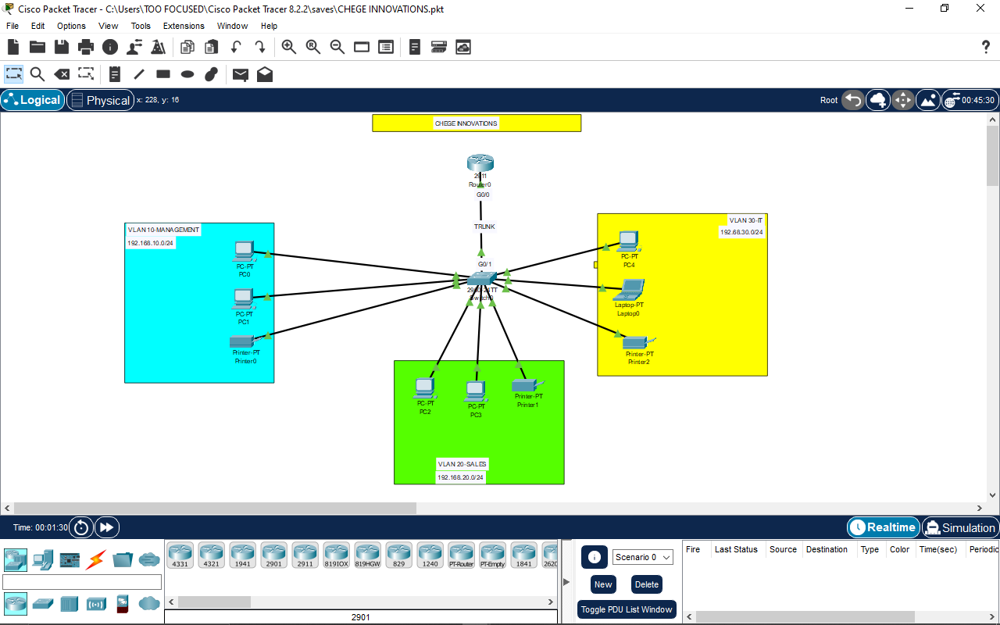
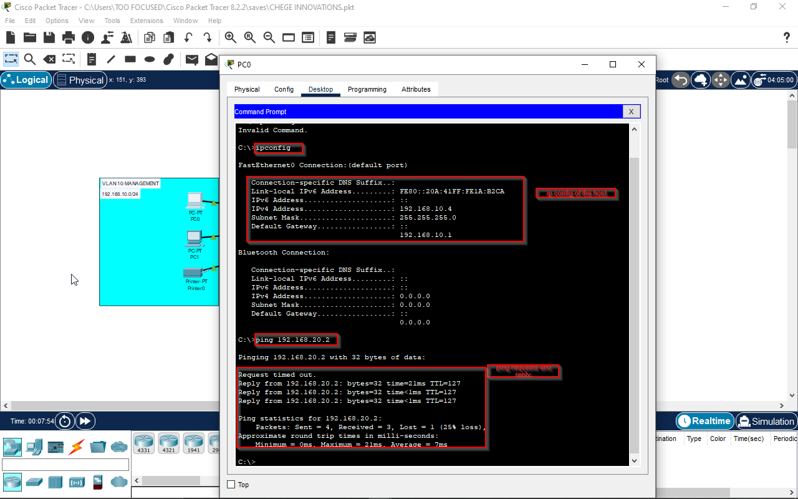
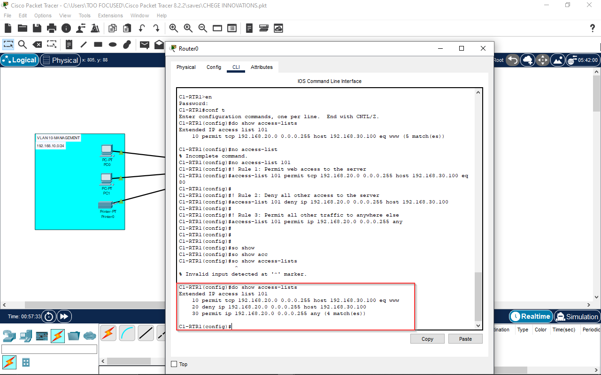

# Chege Innovations - Secure Startup Network Build

## Description / Scenario

This project simulates the deployment of a secure and segmented network for a new startup, "Chege Innovations." The primary goal was to solve the security and performance vulnerabilities inherent in a traditional flat network. This was achieved by using VLANs to logically separate company departments (Management, Sales, and IT). The "Router-on-a-Stick" (ROAS) method was implemented to facilitate secure, controlled communication between these VLANs. Key security features include SSH for encrypted remote management, port security to prevent unauthorized device access, and a securely configured baseline for all network devices.

## Network Topology

## Key Configurations / Features

- **VLAN Segmentation:** The network is logically segmented into three VLANs (Management, Sales, IT) to enhance security and isolate broadcast traffic.
- **Inter-VLAN Routing:** A "Router-on-a-Stick" (ROAS) configuration is used to enable and control communication between the different VLANs.
- **DHCP Services:** The router is configured as a DHCP server to automatically assign IP addresses to end devices in each VLAN.
- **Device Security:** All network devices are hardened with a secure baseline, including encrypted passwords, user accounts, and SSH for secure remote management.
- **Port Security:** Access ports are configured with MAC address "sticky" learning to prevent unauthorized devices from connecting to the network.

## Technologies Used

- Cisco IOS
- VLANs (802.1Q) & Trunking
- Inter-VLAN Routing (Router-on-a-Stick)
- DHCP (Dynamic Host Configuration Protocol)
- SSH (Secure Shell)
- Port Security
- SVI (Switch Virtual Interface)

## Verification Steps

The network's functionality can be verified by confirming that end devices in different VLANs can successfully ping each other. This proves that DHCP, VLAN segmentation, and Inter-VLAN routing are all working correctly.

## Project 2: Internal Firewall (Securing Inter-VLAN Traffic)

##Description / Scenario
Building on the established network, this project addresses a new security requirement from management: traffic between VLANs must be filtered. Specifically, the Sales department should only be able to access the web services (HTTP) on a new server in the IT VLAN, while all other forms of access (like ping) must be blocked. This project demonstrates the implementation of a granular security policy without disrupting general network connectivity for other services.

##Key Configurations / Features
Extended Access Control List (ACL): An extended ACL (ACL 101) was created and applied to filter traffic based on source IP, destination IP, protocol, and port number.

Multi-Rule Policy: The ACL was designed with a multi-step logic:

Permit specific required traffic (HTTP to the server).

Explicitly deny all other traffic to that server.

Permit all other general traffic to allow for normal network operation.

ACL Placement: The ACL was strategically placed inbound on the source VLAN's subinterface for maximum efficiency.

##Verification Steps
The policy was verified by testing from a Sales PC. The results show that web access to 192.168.30.100 is successful, while a ping to the same server fails. Pings to other network resources (like the Management VLAN gateway) remain successful, proving the policy is both effective and correctly targeted.

The show access-lists command on the router confirms the logic, with hit counters showing matches against the specific permit and deny rules.

---
### **For a more detailed, step-by-step explanation of the configuration process, please see the full PDF Walkthrough Report.**
